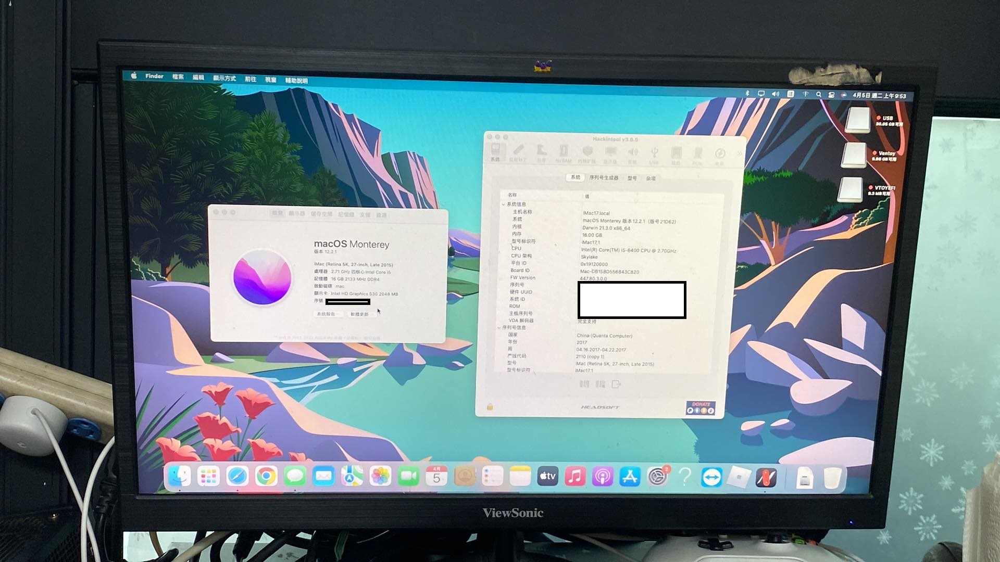

# ASUS-Prime-B250M-A-skylake-Hackintosh

## 🖥️Device
| Model | ASUS Prilme B250M-A |
|------------|-------------------------------|
| CPU | i5 6400(skylake) |
| GPU | Intel HD Garphics 530 |
| RAM | 16GB |
| Audio | Realtek ALC887（id=52） |
| Internet | Realtek RTL8111H |
| BIOS Version | 1205 |

## 📀System
OS：MacOS Monterey

SMBIOS：iMac17,1

OC：0.7.9 and higher

## 🛠️Setting BIOS
Advanced > Intel AES-NI：Disable

Advanced > SATA Configuration > SATA Mode Selection：AHCI

Boot > Fast Boot：Disable

Security > Secure Boot > Secure Boot Control：Disable

- CFG Lock：Disable,You need to use ControlMsrE2.efi or CFGLock.efi

                <key>Tools</key>
                <array>
                        <dict>
                                <key>Arguments</key>
                                <string>unlock</string>
                                <key>Auxiliary</key>
                                <true/>
                                <key>Comment</key>
                                <string></string>
                                <key>Enabled</key>
                                <true/>
                                <key>Name</key>
                                <string>ControlMsrE2</string>
                                <key>Path</key>
                                <string>ControlMsrE2.efi</string>
                                <key>RealPath</key>
                                <false/>
                                <key>TextMode</key>
                                <false/>
                        </dict>
                </array>
## 💡Device status
### Works：
- [x] Graphics HDMI
- [x] USB
- [x] Bluetooth
- [x] Audio
